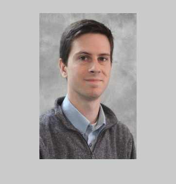
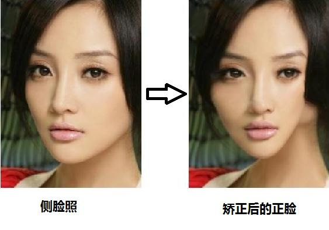
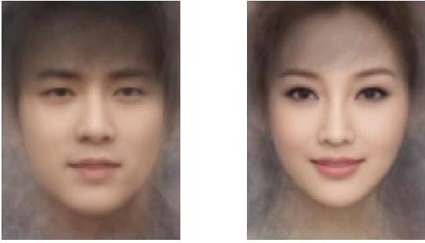
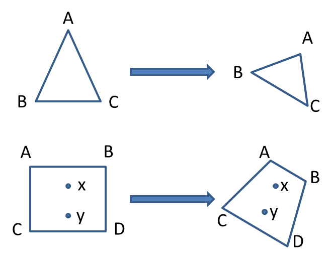
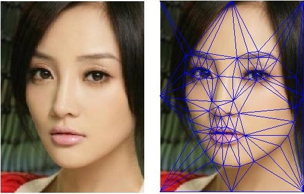
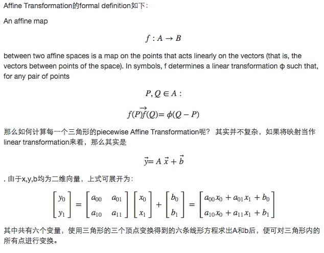

###**Background**
严格来说，无论是仿射变化(affine transformation)还是图像变形(image warping)其实都不能算在计算机视觉(computer vision)的范畴内，而应该属于计算几何(computational geometry)。自己学习计算几何已经是研究生时候的事情，课程更偏向于对诸如Convex hull, Delaunay triangulation, Voronoi diagram等问题的formulation, algorithm design和complexity analysis，几乎没有涉及任何实际的应用场景。最近研究了Brown University的Computational Photography课程，才发现利用简单的geometry便可以做出各种有意思的图像应用，比如在人脸方面：

* **Face morphing**
  Face morphing翻译过来叫做脸部变形，其实大部分的变形都是指从一个人的脸渐渐变形成另一个人的脸，具体效果如下图。Morphing技术在CG工业界的运用很广泛，比如迪士尼就大量使用morphing来制造廉价的3D造型。

  
  (Image from ebnelson's project page, Brown University)

* **3D Face alignment**
  人脸矫正(face alignment)是指把脸调整到标准的大小，位置和姿态，是人脸识别过程中的第一步，也是最关键的一步。人的面部姿态一般会从roll(平面旋转), pitch(左右侧脸)和yaw(抬头低头)三个维度来描述。平面旋转很容易处理，只需将图片旋转一个角度调整至水平即可。而侧脸和低头处理起来比较有挑战，但通过放射变化也可以较好的解决。

  

* **Average face**
  平均脸是指将许多人脸照片叠在一起，得到一张平均长相的照片。可以用同一个人的多张照片求得此人的标准照，也可以将多个人的照片混合在一起，得到平均的长相。如果使用普通的像素叠加，由于五官无法对齐，图片会变得模糊，而通过仿射将脸调整至标准后，效果便好得多。

  

* **美容应用**
  大部分变形类的图片处理都是通过仿射变换实现的。一个经典的用法就是可以通过改变五官的大小和形状达到美容的效果。

  
其实在现实中还有很多例子，比如替换广告牌上的内容（仿射可以将标准的广告牌变成带有透视形变的效果）等等。

###**人脸变形简介**
简单来说，Affine transformation做的事情就是就是将一个图形映射到另一个位置，在映射过程中图形本身的大小，形状可能发生变化，但仍然保留着图形内部点与点之间的位置关系。如下图所示，正方形ABCD通过变换成为梯形ABCD，而内部的两点x,y之间的相对位置并没有发生改变。

利用这一点，我们可以将人脸分割成许多小的三角形（因为三角形是可以定义闭合空间的拥有最少顶点的形状），然后利用改变这些三角形及其邻近三角形的位置和大小，达到变形的效果。因此，大部分的人脸变形都可以分为以下几个步骤：
1. **Landmark detection**: 检测并且标定脸部得landmarks，如眉毛，眼睛，鼻子，嘴，轮廓等等。
2. **Triangulation**: 基于检测出的landmarks将人脸区域分割为多个三角形。
3. **Affine transformation**: 对这些三角形进行仿射变换，投影到新的位置。
 * *Face morphing, 3D矫正*：将参考人脸(reference)以及需要变换的目标人脸(target)都进行triangulation，将目标人脸上的三角形与参考人脸上的三角形的大小与位置一一对应，再一个一个通过仿射变换映射过去。
 * *平均脸*： 和矫正相似，首先对所有照片上的人脸标定，然后求出每个landmark的平均位置，再对这些平均位置做triangulation得到参考脸(reference)。最后将所有照片进行triangulation，全部统一映射到参考脸上三角形的位置。

###Step 1：Landmark detection
我对Landmark detection的技巧还没有深入研究，最传统的做法是基于Active Appearance Model (AAM)或是Active Shape Model(ASM)的。现在对landmark detection作的比较好的几个机构有：

**Face++**
* paper: *Extensive Facial Landmark Localization with Coarse-to-fine Convolutional Network Cascade* [ [pdf](doc/faceppICCV.pdf) ] [ [ppt](doc/facepp_iccv_ppt.ppt) ]
* software: [ [matlab](https://github.com/t0nyren/landmarkpp) ]

**CMU Human Sensing Lab: Intraface**
* paper: *Supervised Descent Method and its Applications to Face Alignment* [ [pdf](doc/sdm.pdf) ]
* software: [ [matlab](http://www.humansensing.cs.cmu.edu/intraface/download_functions_matlab.html) ] [ [C++](http://www.humansensing.cs.cmu.edu/intraface/download_functions_cpp.html) ]

###Step 2：Delaunay Triangulation
Delaunay Triangulation是一种最常见的利用参考点(reference point)将平面分割成三角形的方法。Delaunay Triangulation的标准定义如下：
*"A Delaunay triangulation for a set P of points in a plane is a triangulation DT(P) such that no point in P is inside the circumcircle of any triangle in DT(P). "*
DT的一个重要特性是，它最大化了所有三角形中最小的角度(maximized the minimum angles in all triangles)，因此在使用DT得到的三角形做仿射变换可以防止过大的角度变化而造成的失真。
计算DT的算法：DT并不是一个NP-hard的问题，有许多高效的算法可以解DT，其中最著名的是Lee and Schachter's algorithm，达到了O(nlogn)的time complexity。值得一提的是，由于DT是Voronoi Diagram的dual graph，所以著名的Fortune's algorithm也可以用来求解DT。

###Step 3：Affine Transformation

###**代码**

####基于OpenCV的Delaunay Triangulation [ [C++](https://github.com/t0nyren/DelaunayTriangulation) ]

####3D Alignment [ [C++](https://github.com/t0nyren/piecewiseAffine) ]

####平均脸：[ [matlab](https://github.com/t0nyren/AverageFace) ]
